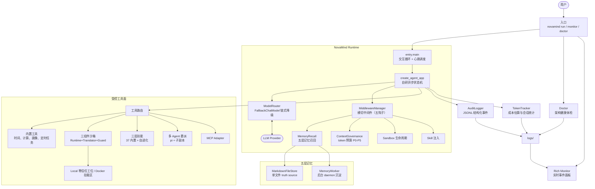

# NovaMind

> **一个可审计的深度研究 Agent 内核。** 不是又一个套壳聊天机器人。

NovaMind 把"Agent 怎么设计"这件事拆到了每个模块都能独立验证的程度——459 个测试守着每一层。它吸收了 Poirot 的内核精华（横切中间件、五层记忆、三组件沙箱、三层技能自进化、多 Agent 共享沙箱、token 预算治理），同时保留了自研编排、零信任边界、可审计可追溯的看家本领。

🧠 **自研编排 + 横切中间件** 不是把所有逻辑塞进 agent loop，而是保留自研异步状态机（`agent → tools → agent` 条件路由），把记忆召回、技能注入、沙箱生命周期、工具执行、上下文治理全部拆成可插拔中间件——`before_agent / after_agent / before_model / after_model / wrap_tool_call` 五个钩子各司其职。加一个功能 = 加一个 middleware，不动核心循环。`app → agents` 依赖严格单向，跨层用 Protocol 破循环依赖。

🧬 **五层长期记忆系统** 从 Schema 到自动沉淀，五层各管各的：L1 frozen dataclass + 原子操作（工具里无 LLM，纯数据变换）；L2 艾宾浩斯衰减公式懒计算（strength 在检索时才算，无后台任务扫表）；L3 Markdown 单文件做 truth source + BM25 检索命中后自动强化写回（retrieve 完成后 `store.update` 提升 strength，下次更容易召回），中文记忆自动切 jieba 分词；L4 per-call HumanMessage 注入（不碰 system prompt cache）；L5 后台 daemon 线程非阻塞沉淀——worker 调 LLM 从对话抽取 episodic 记忆入库，累积够量后合并为 semantic 知识，旧 trace 标 forgotten 被 retriever 过滤。记忆跨 thread 持久化，换会话不丢。

🤝 **多 Agent 编排 + 共享沙箱设计** pi CLI 在 PATH 时自动挂载 `delegate_to_pi` 委派工具——LLM 只需给出 goal + success_criteria，pi（自带模型与 ReAct loop）执行后回传结构化三段式结果（What You Did / Success / Gaps），provider/model 经环境变量配置，实测中文多步任务端到端跑通。共享沙箱是保留的设计方向：`PerSubagentBinder` 让 subagent 复用父 `sandbox_id` 不各开沙箱（pi 侧容器透传待其上游支持 `--sandbox-url` 后收敛）。上面还叠了 L2 演化层（`effective_rate` 跌破阈值 → IVEFocuser 诊断 → LLMMutator 变异 → ScoreDeltaGate 门槛 → GitRatchet 棘轮自动回滚）和 L3 评估层（执行判定 + 四维任务质量打分 + 响应契约检查，RuntimeTracker 监控 applied-rate 退化信号回灌 L2）。

🛡️ **沙箱三组件 + 零信任 + 产物落盘** 三组件设计：Runtime（裸执行）+ PathTranslator（路径翻译/脱敏）+ SecurityGuard（安全校验），切沙箱只换组件不改编排。Local 模式保留零信任底座——shell 元字符/环境变量拦截 + 命令白名单 + 路径穿越拒绝；Docker 模式强制写入/重定向目标必须落在 `/mnt/novamind/user_data/` 挂载区。配合 warm pool 预热池（减少冷启动）、idle auto-destroy（空闲自动销毁）、cross-process lock（多实例并发安全）、WSL2 executor（`D:\foo` → `/mnt/d/foo` 路径翻译），Windows + WSL2 + Docker 三层环境也能跑通。

📐 **上下文治理 + 三层技能自进化** token 预算穿透 FallbackChatModel 拿真实窗口大小（不是硬编码 200K，而是解析到内层模型名动态查表），fraction 分母准确了 P5 熔断阈值才准。技能系统三层：L1 SQLite 存储 + 版本 DAG + 四计数器（selections/applied/completions/fallbacks）+ quality filter + LLM hybrid 选择；L2 自进化——MetricMonitor 监控 effective_rate 跌破阈值时触发，IVEFocuser 五问诊断偏差，LLMMutator 重写技能文本，ScoreDeltaGate 确保变异后分数更高才通过，GitRatchet 棘轮机制自动回滚退化；L3 三层评估——SkillJudgmentAnalyzer 逐技能逐任务判定是否被应用，TaskQualityJudge 四维加权打分（准确度 0.50 / 完整性 0.35 / 效率 0.05 / 深度 0.10），ResponseContractChecker 从技能文本提取契约规则检查响应合规，RuntimeTracker 跟踪 applied-rate 趋势把退化信号回灌 L2 触发再进化。

> 一句话：不是在做功能堆砌，是在认真回答"一个 Agent 内核应该长什么样"——而且还要跑得可信、可追责。

- **Python**：3.12 – 3.13
- **当前版本**：3.0.0（架构对齐 Poirot）
- **协议**：MIT License

[快速启动](#快速启动) · [系统架构](#系统架构) · [运行命令](#运行命令) · [核心能力](#核心能力) · [配置说明](#配置说明) · [开发与测试](#开发与测试)

---

## 核心能力

| 能力 | 当前实现 |
| --- | --- |
| **自研编排** | 自定义异步状态机负责 `agent → tools → agent` 条件路由；核心循环保持薄，横切逻辑抽到中间件。 |
| **横切中间件** | 五个钩子（before/after_agent、before/after_model、wrap_tool_call）承载记忆召回、技能注入、沙箱生命周期、上下文治理、多 Agent 打点。 |
| **LLM 链式降级** | `ModelRouter` + `FallbackChatModel`：多 provider 链式降级，只切瞬时错误（超时/限流/5xx），`is_default` provider 恒在链尾。 |
| **五层长期记忆** | Schema → 衰减遗忘 → BM25 检索（含 jieba 中文分词）→ per-call 注入 → 后台沉淀，跨会话持久化。 |
| **三组件沙箱** | Runtime + PathTranslator + SecurityGuard；Local 零信任白名单 + Docker 路径强制；warm pool + idle destroy + 跨进程锁 + WSL2。 |
| **上下文治理** | token 预算穿透真实窗口 + P0-P5 分段舍弃（externalize / summarize / snapshot / 熔断）。 |
| **三层技能自进化** | SQLite+DAG+四计数器 → 变异 → 四维评估 → 棘轮回滚；37 个内置技能（全英文）。 |
| **多 Agent 委派** | `delegate_to_pi` 自动接线（pi 可用时）；provider/model 可配；PerSubagentBinder 共享沙箱设计就绪，subagent fork 协议已定义待接线。 |
| **CLI + 桌面 GUI + 诊断** | `novamind gui`（pywebview 桌面窗口，WorkBuddy 风格界面）+ `novamind run`（CLI 交互）+ `novamind monitor`（Rich 审计面板）+ `novamind doctor`（架构健康体检 + 退化信号告警）。 |
| **可审计** | 每个关键步骤产生结构化审计事件（JSONL），零信任策略拦截，全程可追溯。 |

---

## 系统架构

NovaMind 以自研异步状态机为执行中枢，横切中间件挂在核心循环的钩子上。下图对应当前代码目录与实际调用路径。



### 一次请求如何执行

1. `novamind run` 创建/恢复 `thread_id` 对应的会话，启动交互循环与后台心跳调度。
2. `MemoryRecallMiddleware` 召回相关长期记忆（BM25 + 衰减强度 + 中文分词），注入为本轮 HumanMessage。
3. `ContextGovernanceMiddleware` 用真实窗口算 token 预算，超长工具结果外化、接近上限时摘要压缩或熔断。
4. 状态机调用经 `ModelRouter` 绑定的 LLM；模型需要工具时进入 `tools` 节点，工具执行走 `wrap_tool_call` 钩子。
5. 工具调用先经零信任策略校验；允许的调用进入内置工具、动态技能、多 Agent 委派或沙盒。
6. 会话与记忆落盘到项目根 `workspace/`，审计事件与 Token 统计写入 `logs/`；`novamind monitor` 可实时观察全程。

### 关键设计边界

| 层级 | 负责什么 | 不负责什么 |
| --- | --- | --- |
| **横切中间件** | 把记忆/技能/沙箱/治理等横切关注点从核心循环剥离。 | 不把业务逻辑塞进状态机本体。 |
| **五层记忆** | 长期知识的衰减、检索、注入与自动沉淀。 | 不做实时对话的短期窗口管理（那是上下文治理的事）。 |
| **零信任沙箱** | 文件与命令操作收敛到工位/挂载区，拦截逃逸。 | 不提供宿主机任意访问或任意命令执行。 |
| **三层技能** | 技能的存储、选择、进化与评估。 | 不替代业务逻辑本身，只约束"怎么做更好"。 |
| **审计与诊断** | 记录并展示输入、上下文、工具、策略、Token、退化信号。 | 不替代外部可观测性平台。 |

---

## 快速启动

以下是 Windows PowerShell 的推荐方式；macOS / Linux 请将虚拟环境激活命令替换为 `source venv/bin/activate`。

### 1. 进入项目并创建虚拟环境

```powershell
cd D:\claudecode\NovaMind
python -m venv venv
.\venv\Scripts\Activate.ps1
python -m pip install --upgrade pip
```

> 项目要求 Python 3.12 或 3.13（`requires-python = ">=3.12,<3.14"`）。3.14 因 langchain-openai 导入期 SSL 兼容问题暂不支持，待上游修复后复核。若 PowerShell 阻止激活脚本，可执行 `Set-ExecutionPolicy -Scope Process Bypass` 后重试，或直接使用 `venv\Scripts\python.exe`。

### 2. 安装 NovaMind

```powershell
python -m pip install -e .
python -m pip install -e ".[dev]"      # 运行测试
python -m pip install -e ".[ollama]"   # 使用 Ollama 本地模型
```

安装完成后提供 `novamind` 命令。等价入口：

```powershell
python -m entry.cli --help
```

### 3. 配置模型

```powershell
novamind config
```

向导选择 provider、模型、API Key 与可选 Base URL，写入项目根目录的 `.env`。

### 4. 运行诊断并启动

```powershell
novamind doctor          # 架构健康体检
novamind gui             # 桌面图形界面（pywebview 窗口）
novamind run             # 命令行交互
```

输入 `exit`、`quit` 或按 `Ctrl+C` 结束 CLI 交互。

---

## 运行命令

| 命令 | 用途 |
| --- | --- |
| `novamind config` | 交互式配置向导，写入 `.env`。 |
| `novamind doctor` | 架构健康体检：分层自检 provider / 记忆 / 技能 / 沙箱 / 中间件 + 退化信号。 |
| `novamind doctor --json` | 以 JSON 输出诊断结果；适合脚本或 CI，出现错误返回非零退出码。 |
| `novamind gui` | 启动桌面图形界面（pywebview 窗口，WorkBuddy 风格布局：侧边栏 + 对话区 + 监控/诊断/技能面板）。 |
| `novamind run` | 交互式 Agent 主循环。 |
| `novamind run --thread-id demo` | 使用指定 `thread_id` 运行或恢复会话。 |
| `novamind monitor --list` | 列出可监控的会话。 |
| `novamind monitor --thread-id demo` | 另开终端实时查看指定会话的审计事件与 Token 信息。 |

GUI 侧边栏内置三个面板（后端接口驱动，非占位）：

| 面板 | 后端接口 | 展示内容 |
| --- | --- | --- |
| 🖥 监控面板 | `/monitor/sessions` + `/monitor/events/{id}` | 会话日志列表 + 审计事件流（工具调用/Token/策略拦截/AI 回复） |
| 🩺 架构诊断 | `/doctor` | 分层体检报告（error/warning/info 分级 + 健康状态） |
| 🧩 技能管理 | `/skills` | 37 个内置技能 + 四计数器 + effective_rate |

### 推荐的双终端工作流

**终端 A**：`novamind run --thread-id demo`
**终端 B**：`novamind monitor --thread-id demo`

数据默认落盘项目根 `workspace/`（记忆、技能库、会话状态），日志写入 `logs/`。

---

## 配置说明

配置文件为项目根目录的 `.env`。不要提交真实密钥。

### 默认 Provider 与模型

```dotenv
DEFAULT_PROVIDER=openai
DEFAULT_MODEL=gpt-4o-mini
OPENAI_API_KEY=sk-...
```

### 链式降级（可选）

NovaMind 支持多 provider 链式降级：瞬时错误（超时/限流/5xx）自动切到下一个 provider，`is_default` 的 provider 恒在链尾兜底。通过 provider profile 注册多个 provider 即可，无需改核心循环。

### 可选运行时变量

| 变量 | 说明 | 默认值 |
| --- | --- | --- |
| `NOVAMIND_WORKSPACE` | 运行时工作空间位置。 | `<project>/workspace` |
| `NOVAMIND_DATA_ROOT` | 打包 exe 的运行时数据根（`workspace/`、`logs/` 的父目录）。 | exe 上一级目录（即项目根） |
| `NOVAMIND_LOG_LEVEL` | 日志级别：`DEBUG` / `INFO` / `WARNING` / `ERROR`。 | `INFO` |
| `NOVAMIND_SKILL_EVOLUTION` | 技能自进化 L2/L3 开关（`on` 开启）。 | 关闭（启动时提醒） |
| `NOVAMIND_MULTIAGENT_EVOLUTION` | 多 Agent L2/L3 开关（`on` 开启）。 | 关闭（启动时提醒） |
| `NOVAMIND_PI_COMMAND` | pi CLI 命令/完整路径（Windows npm 安装时建议指向 `pi.cmd` 完整路径）。 | PATH 自动探测 |
| `NOVAMIND_PI_PROVIDER` | 委派时 pi 使用的 provider（配合 `~/.pi/agent/models.json` 自定义 provider，如 OpenAI 兼容中转端点）。 | pi 默认 |
| `NOVAMIND_PI_MODEL` | 委派时 pi 使用的 model。 | pi 默认 |

---

## 安全模型

NovaMind 把运行时行为约束在明确的边界内，而不是将工具视为任意执行能力：

- **Local 沙箱（零信任）**：文件操作收敛到工位目录，路径穿越（`..` 段 + resolve 越界）被拒绝；Shell 仅白名单命令（`pwd/echo/ls/dir/cat/type/mkdir`），拦截 shell 元字符、环境变量展开与解释器逃逸。
- **Docker 沙箱**：写入与重定向目标强制落在 `/mnt/novamind/user_data/` 挂载区，防止产物丢在容器 `/tmp` 被 `--rm` 清掉。
- **策略层**：`HarnessPolicy` 定义默认允许的工具与需确认的高风险关键词，命中即拦截或生成审计事件。
- **兜底安全**：降级只切瞬时错误，401/400 鉴权与参数错误不降级，避免把密钥泄露给错误 provider。

---

## 项目结构

```text
NovaMind/
├── entry/                              # CLI 入口、monitor、doctor
│   ├── cli.py                          # novamind 命令（config/run/gui/monitor/doctor）
│   └── monitor.py                      # Rich 实时审计面板
├── novamind/core/
│   ├── agent.py                        # create_agent_app 组装（接线中间件 + LLM 路由）
│   ├── state_machine.py                # 自研异步状态机
│   ├── llm/                            # ProviderProfile / ProviderConfig / FallbackChatModel / ModelRouter
│   ├── middlewares/                    # 横切中间件协议 + 记忆/治理/编排中间件
│   ├── memory/                         # 五层长期记忆（schema/strategies/store/retriever/worker/persona）
│   ├── sandbox/                        # 三组件沙箱（contracts/translators/guards/runtimes/local/docker）
│   ├── context_engineering/            # token 预算 + P0-P5 治理
│   ├── skill/                          # 三层技能（store/parser/selector/evolution/eval/builtin_skills）
│   ├── multiagent/                     # 多 Agent（sandbox_binder/subagent/specialist/runtimes/tools）
│   └── webui/                          # 桌面 GUI（server.py FastAPI 后端 + app.py pywebview 窗口 + static 前端）
├── workspace/                          # 默认运行时数据目录（记忆、技能库、会话状态）
├── docs/                               # 运行时 Context Pack 结构化事实来源
├── harness/policies.json               # 工具许可与确认策略
├── logs/                               # JSONL 审计日志
├── tests/                              # 单元 / 端到端 / 集成测试
├── examples/                           # 使用示例
├── pyproject.toml                      # 包与依赖配置
└── Dockerfile                          # 容器化构建定义
```

---

## 开发与测试

标准工作流（依赖唯一事实源是 `pyproject.toml`；`requirements.txt` 由 `uv export` 再生，禁止手改）：

```powershell
uv sync --extra dev                          # 安装依赖（严格按 uv.lock）
uv run --no-sync pytest tests -q             # 全量 459 个测试（约 10 秒）
uv run --no-sync pytest tests/unit -q        # 单元层
uv run --no-sync pytest tests/integration -q # 集成/端到端层
uv run --no-sync ruff check novamind entry tests   # Lint（CI 强制）
uv run --no-sync mypy novamind/core/policy.py novamind/core/token_tracker.py     novamind/core/event_bus.py novamind/core/task_store.py     novamind/core/skill/types.py novamind/core/sandbox/types.py  # 类型检查（首批）
novamind doctor --json                       # 运行时自检
```

- **Python**：3.12–3.13（CI 矩阵同版本；3.14 因 langchain-openai 导入期 SSL 崩溃暂排除）
- **覆盖率**：全量约 75%，CI 底线 `--cov-fail-under=70`，只升不降
- **规范**：修 bug 必须附带可复现的回归测试随同一提交；新模块合入自带测试；
  skip 测试注明原因

### 打包桌面应用

```powershell
pip install pyinstaller
pyinstaller NovaMind.spec --noconfirm   # 产物 dist/nova-mind-gui.exe（单文件）
```

> 注意：在 WorkBuddy 沙箱内打包时需先关闭安全删除保护（`CODEBUDDY_SAFE_DELETE_SANDBOX=0` 前缀），否则 pyinstaller 覆盖 `build/` 中间产物会被拦截。打包后的 exe 把运行时数据（对话历史/日志/技能库）持久化到 exe 上一级目录（即项目根），与源码运行共享同一份 `workspace/` 与 `logs/`；`.env` 自动读取项目根那份，无需复制到 `dist/`。

### 测试覆盖

当前共 **459 个测试**（unit + integration 两层），锁死各层关键不变量：

| 层 | 覆盖不变量 |
| --- | --- |
| **LLM 降级** | 降级只切瞬时错误、401/400 不降级、`is_default` 恒在链尾、真实窗口解析 |
| **中间件** | 钩子按序调用、结果正确合并、默认无中间件时行为不变 |
| **五层记忆** | lazy decay 无后台任务、检索强化写回、forgotten 过滤、encode 幂等、中文分词 |
| **沙箱** | 路径穿越/越权写入被拒、shell 元字符拦截、命令白名单、Docker 写入限挂载区、warm pool 复用 |
| **上下文治理** | 真实窗口解析、P1 外化、P4 摘要、P5 熔断、用户画像 procedural 记忆 |
| **技能** | version DAG + 单指针、register 不写计数器、进化闭环、GitRatchet 回滚、契约检查 |
| **多 Agent** | 委派工具生成与接线（pi 检测/shim 绕过/provider 透传）、策略前缀放行、pi 委派 prompt/错误归一化、UTF-8 输出解码回归 |
| **接线** | before/after_model、wrap_tool_call 在 LLM/工具调用时被触发 |
| **趋势** | RuntimeTracker applied-rate 趋势判定 + 退化检测 |

---

## 常见问题

### `novamind` 不是内部或外部命令

在已激活的虚拟环境中执行 `python -m pip install -e .`，或直接 `python -m entry.cli run`。

### 启动时提示模型配置缺失

执行 `novamind config`，或检查 `.env` 的 `DEFAULT_PROVIDER`、`DEFAULT_MODEL` 与对应 API Key。

### 为什么文件或 Shell 操作被拒绝

检查目标是否在工位/挂载区内、命令是否在白名单、是否命中策略确认关键词。运行 `novamind doctor` 并查看 `logs/` 最近事件。

### 中文记忆检索不到

确认已安装 `jieba`（`pip install jieba`）；缺失时自动回退空格分词，中文检索会退化。

---

## 致谢

NovaMind 的架构对齐 [Poirot](https://github.com/earendil-works/poirot)——一个认真做架构的深度研究 Agent。感谢其开源内核提供的设计参考。

- [LangChain](https://python.langchain.com/)：模型与工具调用抽象
- [Rich](https://github.com/Textualize/rich)：终端监控与展示
- [Typer](https://typer.tiangolo.com/)：命令行接口

## License

[MIT](LICENSE)
