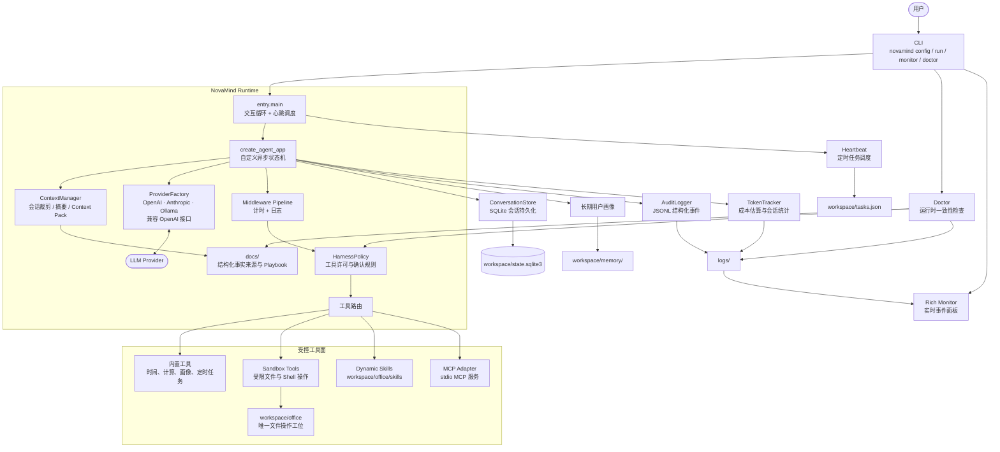

# NovaMind

> **透明、可审计、受零信任边界约束的 AI Agent 运行时。**

NovaMind 将模型调用、工具执行、会话记忆、运行时上下文和安全策略组装为一个可在终端运行的智能体。它不是黑盒式的聊天封装：每个关键步骤都会产生可追溯的结构化事件，并可由实时监控面板查看。

- **Python**：3.10+
- **当前版本**：2.0.0
- **协议**：MIT License

[快速启动](#快速启动) · [系统架构](#系统架构) · [运行命令](#运行命令) · [核心能力](#核心能力) · [配置说明](#配置说明) · [开发与测试](#开发与测试)

---

## 核心能力

| 能力 | 当前实现 |
| --- | --- |
| **可观测 Agent 循环** | 自定义异步状态机负责 `agent → tools → agent` 条件路由；LLM 输入、工具调用、工具结果、Token 用量、上下文包与策略结果都会写入审计事件。 |
| **结构化 Context Pack** | 每轮从 `docs/` 中选择最小相关运行时文档作为受控上下文；处理文件任务时会额外加载文件编辑 playbook，并记录 `context_pack_loaded` 事件。 |
| **分层会话记忆** | 会话按 `thread_id` 隔离，SQLite 持久化历史；超长对话会将较早消息压缩为摘要，同时保留近期上下文和用户画像。 |
| **多模型提供商** | 支持 OpenAI、Anthropic、阿里云 DashScope、腾讯混元、智谱 Z.AI、其他 OpenAI 兼容接口及 Ollama 本地模型。 |
| **可控工具执行** | 提供时间、AST 安全计算、用户画像、定时任务和受沙盒限制的文件 / Shell 工具；写入及高风险关键词命中时由策略层拦截。 |
| **动态扩展** | 自动发现 `workspace/office/skills/` 中包含 `SKILL.md` 或 `README.md` 的技能；也可通过 MCP 适配器接入 MCP 服务工具。 |
| **成本与运行监控** | 按会话追踪 Token 与成本估算，JSONL 审计日志可由 Rich 实时监控面板展示。 |
| **运行前诊断** | `doctor` 会校验结构化 docs、策略文件、工具契约和近期策略违规信号，便于在启动前发现配置漂移。 |

---

## 系统架构

NovaMind 以自定义异步状态机为执行中枢：一次用户请求会经过上下文选择、模型推理、策略校验和工具执行；同时将会话、成本和审计事件分别持久化和呈现。下面的架构图对应当前代码目录与实际调用路径。



### 一次请求如何执行

1. `novamind run` 创建或恢复 `thread_id` 对应的会话，并启动输入循环与后台心跳调度。
2. `ContextManager` 保留近期消息、摘要较早消息，并从 `docs/` 选择最小相关 **Context Pack**；文件类任务会加载文件编辑 playbook。
3. 状态机调用已绑定工具的 LLM；模型需要工具时进入 `tools` 节点，否则直接结束本轮。
4. 每个工具调用先经过 `HarnessPolicy`；允许的调用才会进入内置工具、动态技能、MCP 或 office 沙盒。
5. 会话写入 SQLite，审计事件与 Token 统计写入日志；`novamind monitor` 可在另一个终端实时观察整个过程。

### 关键设计边界

| 层级 | 负责什么 | 不负责什么 |
| --- | --- | --- |
| **Context Pack** | 为当前任务提供可追溯、最小化的运行时事实和 playbook。 | 不把整个项目文档无差别塞入提示词。 |
| **Policy** | 对工具白名单、确认关键词和违规事件进行统一控制。 | 不把模型的任意工具请求直接执行。 |
| **Sandbox** | 将文件和 Shell 操作收敛到 `workspace/office/`。 | 不提供宿主机任意文件访问或任意命令执行。 |
| **Audit & Monitor** | 记录并展示输入、上下文、工具、策略和 Token 事件。 | 不替代业务日志分析或外部可观测性平台。 |

---
## 快速启动

以下是 Windows PowerShell 的推荐方式；macOS / Linux 请将虚拟环境激活命令替换为 `source venv/bin/activate`。

### 1. 进入项目并创建虚拟环境

```powershell
cd D:\claudecode\NovaMind
python -m venv venv
.\venv\Scripts\Activate.ps1
python -m pip install --upgrade pip
```

> 项目要求 Python 3.10 或更高版本。若 PowerShell 阻止激活脚本，可在当前终端执行 `Set-ExecutionPolicy -Scope Process Bypass` 后重试，或直接使用 `venv\Scripts\python.exe` 执行下文命令。

### 2. 安装 NovaMind

```powershell
# 运行框架
python -m pip install -e .

# 如需运行测试，安装开发依赖
python -m pip install -e ".[dev]"

# 如需使用 Ollama 本地模型，额外安装其适配依赖
python -m pip install -e ".[ollama]"
```

安装完成后会提供 `novamind` 命令。若当前 shell 未识别该命令，可使用等价入口：

```powershell
python -m entry.cli --help
```

### 3. 配置模型

最方便的方式是运行交互式向导：

```powershell
novamind config
```

向导会选择 provider、模型、API Key 和可选 Base URL，并写入项目根目录的 `.env`。首次启动也可以先复制模板再手动填写：

```powershell
Copy-Item .env.example .env
```

### 4. 运行诊断并启动

```powershell
# 确认 docs、策略、工具契约和近期日志状态正常
novamind doctor

# 启动交互式 Agent（自动创建新会话）
novamind run
```

至此即可在终端中直接输入任务。输入 `exit`、`quit` 或按 `Ctrl+C` 可结束当前交互。

---

## 运行命令

| 命令 | 用途 |
| --- | --- |
| `novamind config` | 打开交互式配置向导并写入 `.env`。 |
| `novamind doctor` | 检查 docs、`harness/policies.json`、工具契约和最近的策略违规事件。 |
| `novamind doctor --json` | 以 JSON 输出诊断结果；适合脚本或 CI 调用。出现错误时返回非零退出码。 |
| `novamind run` | 启动新会话的交互式 Agent。 |
| `novamind run --thread-id demo` | 使用指定 `thread_id` 运行或恢复该会话。 |
| `novamind monitor --list` | 列出当前可监控的会话。 |
| `novamind monitor --thread-id demo` | 在另一个终端实时查看指定会话的审计事件、上下文包、策略检查和 Token 信息。 |

### 推荐的双终端工作流

**终端 A：运行 Agent**

```powershell
novamind run --thread-id demo
```

**终端 B：观察同一会话**

```powershell
novamind monitor --thread-id demo
```

日志默认写入 `logs/`，会话状态默认保存在 `workspace/state.sqlite3`。

---

## 配置说明

配置文件为项目根目录的 `.env`。不要将真实密钥提交到版本控制系统。

### OpenAI 与兼容接口

```dotenv
DEFAULT_PROVIDER=openai
DEFAULT_MODEL=gpt-4o-mini
OPENAI_API_KEY=sk-...

# 可选：代理或兼容服务地址
# OPENAI_API_BASE=https://api.example.com/v1
```

OpenAI 兼容 provider 可设为 `openai`、`aliyun`、`dashscope`、`tencent`、`z.ai` 或 `other`。其中阿里云、腾讯和 Z.AI 在未配置 `OPENAI_API_BASE` 时会使用内置兼容地址。

### Anthropic

```dotenv
DEFAULT_PROVIDER=anthropic
DEFAULT_MODEL=claude-3-5-sonnet-latest
ANTHROPIC_API_KEY=sk-ant-...

# 可选：代理地址
# ANTHROPIC_BASE_URL=https://api.anthropic.com
```

### Ollama（本地模型）

先安装可选依赖并确保 Ollama 服务及目标模型已就绪：

```powershell
python -m pip install -e ".[ollama]"
ollama serve
# 新开终端（仅首次下载模型时需要）
ollama pull llama3.1
```

然后在 `.env` 中配置：

```dotenv
DEFAULT_PROVIDER=ollama
DEFAULT_MODEL=llama3.1
OLLAMA_BASE_URL=http://localhost:11434
```

### 可选运行时变量

| 变量 | 说明 | 默认值 |
| --- | --- | --- |
| `NOVAMIND_WORKSPACE` | 运行时工作空间位置，包含会话数据库、记忆、任务和沙盒工位。 | `<project>/workspace` |
| `NOVAMIND_LOG_LEVEL` | 日志级别：`DEBUG`、`INFO`、`WARNING` 或 `ERROR`。 | `INFO` |

---

## 安全模型与工作空间

NovaMind 将运行时行为约束在明确的边界内，而不是将工具视为任意执行能力：

- 文件操作只能访问 `workspace/office/`；路径穿越会被拒绝。
- Shell 工具仅允许有限白名单命令，并会拦截 Shell 元字符、环境变量展开及解释器逃逸方式。
- `harness/policies.json` 定义默认允许的工具与需确认的高风险关键词；命中后会生成策略检查或违规审计事件。
- 动态技能默认从 `workspace/office/skills/` 扫描。每个技能目录应包含 `SKILL.md` 或 `README.md`；技能需先以 `help` 模式读取说明，再以 `run` 模式执行，且执行仍受 office 沙盒限制。

项目中的 `docs/` 不是普通说明文件：它是运行时的结构化事实来源。修改工具能力、策略或会话模型时，请同步更新相应文档，并执行 `novamind doctor`。

---

## 项目结构

```text
NovaMind/
├── entry/                    # CLI、交互主循环与 Rich 监控面板
├── novamind/core/            # 状态机、Agent、上下文、策略、提供商与工具
├── novamind/core/tools/      # 内置工具与零信任沙盒工具
├── docs/                     # 运行时 Context Pack 的结构化事实来源
├── harness/policies.json     # 工具许可与确认策略
├── workspace/                # 默认运行时数据目录（可用环境变量覆盖）
│   ├── state.sqlite3         # 会话状态持久化
│   ├── memory/               # 用户长期画像
│   └── office/               # 文件与 Shell 工具唯一可操作的沙盒工位
├── logs/                     # JSONL 审计日志
├── tests/                    # 单元、Agent Eval 与集成测试
├── examples/                 # 使用示例
├── pyproject.toml            # 包与依赖配置
└── Dockerfile                # 容器化构建定义
```

---

## 内置工具

| 工具组 | 工具 |
| --- | --- |
| 基础信息 | `get_current_time`、`get_system_model_info` |
| 安全计算 | `calculator`（基于 AST，不使用 `eval`） |
| 长期记忆 | `save_user_profile` |
| 定时任务 | `schedule_task`、`list_scheduled_tasks`、`modify_scheduled_task`、`delete_scheduled_task` |
| 沙盒文件与命令 | `list_office_files`、`read_office_file`、`write_office_file`、`execute_office_shell` |

Agent 会在每次调用前依据 `harness/policies.json` 评估工具许可；因此，新增工具时应同时更新策略和 `docs/tool-contracts.md`。

---

## 扩展方式

### 自定义技能

在 `workspace/office/skills/` 下创建技能目录，并提供 `SKILL.md` 或 `README.md` 描述文件。NovaMind 会在创建 Agent 时自动扫描并加载已启用技能。

```text
workspace/office/skills/
└── report-helper/
    └── SKILL.md
```

技能运行命令必须留在 office 工位内，并经过 `execute_office_shell` 的安全限制。

### MCP 服务

MCP 适配器可将 stdio MCP 服务暴露的工具转换为 NovaMind 工具。通过 `MCPManager` 在应用集成代码中注册服务后，`create_agent_app()` 会与内置工具和动态技能一起加载它们。MCP 服务本身的命令、参数和环境变量应由部署方显式配置与审查。

---

## 开发与测试

```powershell
# 安装开发依赖
python -m pip install -e ".[dev]"

# 运行完整测试套件
python -m pytest -q

# 运行某个测试文件
python -m pytest tests/test_doctor.py -q

# 运行运行时自检
novamind doctor --json
```

在提交涉及工具、策略、docs 或上下文选择逻辑的改动前，至少运行相关测试和 `novamind doctor`。

### 测试覆盖

当前共 **147 个测试**，覆盖以下维度：

| 测试文件 | 测试数 | 覆盖范围 |
| --- | --- | --- |
| `test_agent.py` | 14 | Token 提取、异步线程隔离、Context Pack 日志、Harness Policy 工具拦截、中间件管道、摘要生成线程隔离 |
| `test_agent_eval.py` | 13 | 单轮/多轮对话、工具调用收敛、工具异常处理、上下文裁剪、摘要即时使用、会话隔离、Provider 错误、沙盒拒绝 |
| `test_context.py` | 15 | 回合裁剪、系统消息保留、工具消息分组、系统提示词构建、Context Pack 解析、**摘要词法评估**、**LLM 二次评估**（含真实 API 调用） |
| `test_doctor.py` | 4 | 诊断报告结构、缺失 docs 检测、策略违规扫描 |
| `test_e2e.py` | 6 | **端到端全链路**：工具调用循环、上下文裁剪+摘要、会话持久化跨重启恢复、策略违规拦截、最大迭代上限、Context Pack 按需加载 |
| `test_integration.py` | 14 | CLI 会话管理、日志字段对齐、监控发现、SQLite 线程隔离、摘要持久化、端到端 Agent 循环 |
| `test_logger.py` | 7 | 脱敏递归、密钥截断、**有界队列背压**、**关键事件优先级驱逐**、**double-shutdown 安全** |
| `test_middleware.py` | 6 | 空管道、单中间件、中间件顺序、计时、日志、限流 |
| `test_monitor.py` | 10 | 线程 ID 安全化、会话列表、日志目标解析 |
| `test_plugin_loader.py` | 1 | 技能目录路径解析 |
| `test_provider.py` | 8 | OpenAI/Anthropic/Ollama Provider 工厂、缺失 Key/包错误、兼容地址覆盖 |
| `test_sandbox_tools.py` | 3 | Shell 安全命令、解释器逃逸拦截、路径穿越前缀绕过拒绝 |
| `test_session.py` | 10 | 线程 ID 生成、CLI thread-id 传递、会话隔离、监控目标对齐 |
| `test_state_machine.py` | 18 | 状态容器、边路由、SQLite 持久化、跨调用状态保持、**最大迭代上限标记 + `__limit__` 事件**、裁剪后消息移除 |
| `test_token_tracker.py` | 8 | Token 记录、成本估算、会话统计、线程隔离、未知模型默认定价 |

#### 关键测试场景

- **LLM 二次评估摘要**：当词法评估判定摘要质量为 `low` 或 `acceptable` 时，自动触发 LLM 二次评估，从信息保留率、幻觉、连贯性三个维度打分；高质量摘要跳过 LLM 调用节省成本；LLM 返回非 JSON 时优雅回退。
- **端到端全链路**：通过 `patch` + `FakeLLM` 走真实 `create_agent_app` -> `agent_node` -> `tool_executor` 完整路径，验证消息序列、审计事件、策略拦截、迭代上限、会话持久化等核心行为。
- **审计日志优先级驱逐**：队列满时按 `critical > normal > low` 三级优先级驱逐，`policy_violation` 等关键事件绝不丢弃；`llm_input` 等低价值事件优先驱逐。

```powershell
# 运行端到端测试
python -m pytest tests/test_e2e.py -v

# 运行 LLM 评估测试（需要 .env 中配置真实 API Key）
python -m pytest tests/test_context.py::TestSummaryLLMEvaluation -v

# 运行审计日志队列测试
python -m pytest tests/test_logger.py -v
```

---

## 常见问题

### `novamind` 不是内部或外部命令

请先在已激活的虚拟环境中执行 `python -m pip install -e .`。也可以直接使用：

```powershell
python -m entry.cli run
```

### 启动时提示模型配置缺失

执行 `novamind config`，或检查 `.env` 中是否已设置 `DEFAULT_PROVIDER`、`DEFAULT_MODEL` 以及对应 provider 的 API Key。

### Ollama 无法连接

确认已执行 `python -m pip install -e ".[ollama]"`，且 `ollama serve` 正在运行；如服务不在默认端口，请设置 `OLLAMA_BASE_URL`。

### 为什么文件或 Shell 操作被拒绝

请检查目标是否位于 `workspace/office/` 内、命令是否在白名单范围内，以及请求是否命中了 `harness/policies.json` 的确认关键词。随后可运行 `novamind doctor` 并查看 `logs/` 中的最近事件。

---

## 致谢

- [LangChain](https://python.langchain.com/)：模型与工具调用抽象
- [Rich](https://github.com/Textualize/rich)：终端监控与展示
- [Typer](https://typer.tiangolo.com/)：命令行接口

## License

[MIT](LICENSE)
