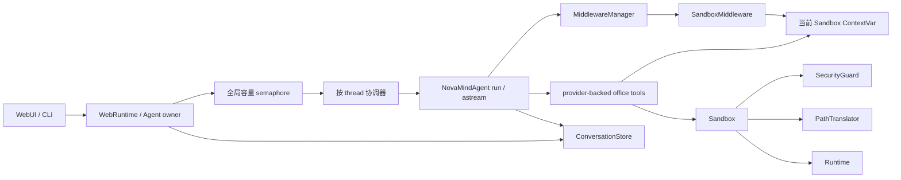

# NovaMind 下一阶段加固实施方案

> 状态：可执行草案  
> 基线日期：2026-09-05  
> 范围：默认工具接入三组件沙箱、Agent/WebUI 并发与生命周期、存储分页、API 错误边界、桌面服务安全边界  
> 原则：以下“现状”均来自当前仓库源码和测试；尚未实现的内容均明确标为“拟新增”或“建议”，不把计划写成既成事实。

## 1. 目标与完成标准

本轮不是继续堆功能，而是把已经存在但没有贯通的能力接到真实运行链路，并消除 WebUI 在并发、取消、无界读取和错误泄露上的风险。

完成后应满足：

1. 默认 CLI/WebUI 的四个 office 工具真正通过 `SandboxProvider -> Sandbox -> SecurityGuard/PathTranslator/Runtime` 执行，不再直接使用宿主机 `open()`、`os.listdir()` 等路径。
2. 保留四个既有工具名、参数 schema、公开导出和主要行为，插件内嵌调用也复用当前会话的 sandbox。
3. 同一 `thread_id` 的运行和删除串行化，不同 thread 可以并行；取消或异常不会留下半轮会话状态或泄漏 sandbox。
4. WebUI 不再用一把全局锁串行所有用户请求，并具有明确的并发上限、启动/关闭生命周期和断连语义。
5. 会话、历史、监控事件和技能列表都采用稳定、有界的分页；Agent 的完整历史恢复语义保持不变。
6. HTTP/SSE 错误对客户端稳定且不泄露原始异常；OpenAPI 描述与真实返回一致。
7. 桌面 GUI 明确且强制只绑定 loopback；远程服务不从现有桌面入口偷偷开放。
8. 每个阶段都能单独回滚；最终通过现有 CI 门禁和新增并发、取消、分页、安全测试。

## 2. 已确认的真实基线

### 2.1 当前工作区

当前有一组尚未提交的前序修复：

- `README.md`、`docs/functional-report.md`：按真实测试和行为修正文档。
- `novamind/core/agent.py`：默认模型路由接线及兼容回退。
- `novamind/core/sandbox/local/local_sandbox_provider.py`：默认命令白名单哨兵语义。
- `novamind/webui/server.py`：删除会话时同步清理 Agent 内存状态和 SQLite。
- 对应的 agent、sandbox、WebUI 测试。

这组改动已经通过当前的 580 个 unit/integration 测试、Ruff、CI 目标 mypy 和 diff 检查。实施本方案前应先把它们作为独立基线审阅并提交，后续阶段不得覆盖或混入这组修改。

### 2.2 沙箱真实调用链

默认 CLI/WebUI 当前的调用链是：

```text
create_agent_app()
  -> BUILTIN_TOOLS + dynamic/MCP/delegate tools
  -> llm.bind_tools(...)
  -> HarnessPolicy.evaluate_tool_call(...)
  -> MiddlewareManager.dispatch("wrap_tool_call", ...)
  -> asyncio.to_thread(tool.invoke, tool_args)
  -> tools/sandbox_tools.py 直接访问宿主文件系统
```

`list_office_files`、`read_office_file`、`write_office_file` 和 `execute_office_shell` 目前没有经过 `SandboxProvider`。三组件实现已存在于 `novamind/core/sandbox/`，但生产默认链路没有创建 Local/Docker provider，也没有 `SandboxMiddleware`。

需要保留的真实兼容点：

- 工具名和参数：`list_office_files(sub_dir="")`、`read_office_file(filepath)`、`write_office_file(filepath, content, mode="w")`、`execute_office_shell(command)`。
- `mode="a"` 的自动补换行行为、读取 10000 字符截断、路径穿越和危险命令拒绝。
- `tools/__init__.py` 的公开导出、policy 中的工具名、直接 import/invoke，以及 `plugin_loader.py` 对 `execute_office_shell` 的嵌套调用。
- 当前 Local provider 的所有 thread 默认共享同一个 `OFFICE_DIR` 物理目录。仅 sandbox ID 隔离，不应在本轮声称已经做到 per-thread 物理隔离。

### 2.3 WebUI、Agent 和存储真实调用链

`POST /chat` 返回 SSE，`_stream_chat()` 当前在全局 `_chat_lock` 内调用单例 Agent 的 `astream()`。这意味着不同 thread 也完全串行。直接删除全局锁又会暴露 Agent 的 `_states`、`_persisted_counts`、LRU 淘汰和同 thread 状态更新竞态。

已确认的其他问题：

- `CancelledError` 不属于 `Exception`；流取消可能跳过正常持久化和 `after_agent`。
- `_stream_chat()` 在 `finally` 中 yield `done`，关闭 async generator 时可能触发 `async generator ignored GeneratorExit`。
- SQLite 操作同步运行在事件循环；`save_messages()` 逐条事务，`list_threads()` 有 N+1 标题查询。
- `/sessions`、`/history`、`/monitor/events`、`/skills` 存在无界读取；监控事件会整文件读入内存。
- `ContextManager._last_summary_eval` 是跨请求共享可变状态；`FallbackChatModel._active` 在并发调用下存在竞态。
- 前端用全局 `running` 和 `currentMessages`；切换会话后，旧请求的流可能写进新会话，也没有 AbortController。
- FastAPI 没有 lifespan；Agent、provider、技能存储、MCP 和后台任务没有统一 ownership/cleanup。

### 2.4 当前 HTTP 兼容面

仓库内唯一已知客户端是 `novamind/webui/static/index.html`。它直接依赖现有顶层字段：`sessions`、`messages`、`events`、`skills`、`count`，并手工解析 SSE 的 `thread/tool/text/limit/error/done`。

因此本轮采用加法兼容：路径、方法、已有成功字段和 SSE 类型不改名；分页只新增 `pagination`。未知 history/monitor 会话继续返回 200 空数组，删除不存在会话继续幂等返回 200。

## 3. 目标架构与关键顺序



必须遵守的实施顺序：

1. 先固定旧工具和 API 契约，再替换实现。
2. 先把并发正确性放进 Agent，再删除 WebUI 全局锁。
3. 先定义取消回滚和 cleanup，再开放多 thread 并发。
4. Web 专用分页使用新方法，不给 `load_messages()` 偷加默认 limit。
5. 先让前端能识别结构化错误，再把后端静默空结果改成 5xx。

## 4. 拟新增接口与不变量

以下名称是实施建议，不是当前已经存在的 API。

### 4.1 Sandbox 工具和上下文

建议新增：

```python
def build_sandbox_tools(
    *,
    require_context: bool = True,
) -> list[BaseTool]: ...

def build_default_sandbox_provider(settings: Settings) -> SandboxProvider: ...
```

工具工厂生成的四个工具只从当前运行上下文获取 `Sandbox`，缺少上下文时 fail closed。模块级旧别名继续存在，用于直接调用兼容；只有该 legacy 路径可创建延迟 Local fallback，Agent 默认绑定的工具不得静默 fallback。

建议新增一个内部 `ContextVar[Sandbox | None]` 及 set/reset token 辅助函数。`asyncio.to_thread()` 会复制调用上下文，因此现有同步 LangChain tool 的执行方式可以继续保留。

相对路径在 façade 统一转成 `/mnt/novamind/user_data/...`：先把 `\\` 归一为 `/`，拒绝 `..` 和其他绝对根，再交给 Guard 二次校验。错误只返回稳定、脱敏的 tool result，不回传宿主路径。

### 4.2 Agent lifecycle 和并发

建议在 `NovaMindAgent` 内新增私有 `_ThreadRunCoordinator`：

```python
async with coordinator.hold(thread_id):
    ...

async def aclear_conversation(self, thread_id: str) -> None: ...
async def aclose(self) -> None: ...
```

不变量：

- 相同 `thread_id` FIFO 串行；不同 thread 不因状态锁互相阻塞。
- lock registry 有引用计数，空闲后删除，不能随会话数无限增长。
- 正在运行的 state 被 pin，LRU 不淘汰 active state；全部 active 时允许暂时超过缓存上限。
- 每轮开始保存 state 和 `_persisted_counts` 快照；`BaseException`（包含取消）时恢复快照、记录 audit、再次抛出。
- `after_agent` 和 sandbox release 在成功、普通异常、取消、generator close 时均恰好执行一次。
- 对外部工具或 `to_thread()` 已经产生的副作用无法回滚；文档必须明确这一边界。

### 4.3 ConversationStore 分页

保持现有完整恢复接口：

```python
load_messages(thread_id: str) -> list[BaseMessage]
```

新增 Web 专用接口：

```python
load_message_page(
    thread_id: str,
    *,
    limit: int,
    before_id: int | None = None,
) -> MessagePage: ...

list_thread_page(
    *,
    limit: int,
    before: ThreadCursor | None = None,
) -> ThreadPage: ...
```

`save_messages()` 改为单连接、单事务、`executemany()`，要么整批成功，要么整批回滚。初始化增加幂等索引，至少覆盖 `(thread_id, id)`；启用 WAL 和合理 `busy_timeout` 前要用并发测试确认 Windows/Linux 行为。

### 4.4 HTTP 成功和错误形状

成功响应保留原字段，只新增：

```json
{
  "sessions": [],
  "pagination": {
    "limit": 50,
    "has_more": true,
    "next_cursor": "opaque-token"
  }
}
```

HTTP 错误统一为：

```json
{
  "error": {
    "code": "history_store_unavailable",
    "message": "Unable to load conversation history.",
    "request_id": "..."
  }
}
```

SSE 已开始后不能改变 HTTP 状态，因此保留顶层 `message`：

```json
{
  "type": "error",
  "code": "agent_stream_failed",
  "message": "Agent execution failed.",
  "request_id": "..."
}
```

客户端不接收 `str(exc)`。详细 traceback 仅进服务端日志，并通过 `request_id` 关联。

### 4.5 建议容量默认值

这些是建议值，不是当前事实；实现时放进命名常量并写入 API 文档：

| 集合 | 默认 limit | 最大 limit | 第一页语义 |
|---|---:|---:|---|
| sessions | 50 | 200 | 最新会话 |
| history | 100 | 500 | 最新消息，响应仍按旧到新 |
| monitor sessions | 50 | 200 | 最近修改 |
| monitor events | 500 | 2000 | 最新事件，响应仍按旧到新 |
| skills | 100 | 200 | 名称升序 |

聊天建议限制 `message <= 64K` 字符、请求体 `<= 256 KiB`。如果后续产品数据证明不足，只调整配置和文档，不移除硬上限。

## 5. 分阶段实施

## Phase 0 — 冻结基线与兼容契约

### 实现

1. 先审阅并单独提交当前 8 个 modified 文件，形成可回退基线。
2. 给四个 office 工具补 golden tests，固定名称、参数 schema、相对路径、`w/a`、append 换行、10000 字符截断、错误类别和拒绝边界。
3. 给当前 REST/SSE 成功响应补 contract tests，固定已有顶层字段和事件类型。
4. 生成并保存当前 OpenAPI 的针对性断言，不保存易漂移的整份 snapshot。

### 主要文件

- `tests/unit/test_sandbox_tools.py`
- `tests/integration/test_webui.py`
- `tests/integration/test_webui_endpoints.py`
- `novamind/core/tools/sandbox_tools.py`
- `novamind/webui/server.py`

### 验证

- [ ] 模块级四个工具仍可直接 import/invoke。
- [ ] `plugin_loader` 嵌套调用路径有回归测试。
- [ ] API 测试明确哪些是必须兼容字段，避免锁死 emoji 或整段错误文案。
- [ ] 前序 580 个 unit/integration 测试继续通过。

### 防误改

- 不把 README 或旧迁移计划里的“已完成”当作接线证据，以生产调用链和测试为准。
- 不在同一个提交里开始重构实现。

## Phase 1 — 构建 provider-backed 工具 façade

### 实现

1. 在 `novamind/core/tools/sandbox_tools.py` 增加当前 Sandbox 上下文访问器和 `build_sandbox_tools()`。
2. 四个 factory 工具保留原名称和参数，文件操作只调用 `Sandbox.read_file/write_file/list_dir` 等公开 API。
3. 路径标准化和旧行为留在 façade；Guard 仍是最终授权边界。
4. 保留旧模块级工具作为 compatibility aliases，使直接调用和 `plugin_loader` 不破坏。
5. shell 命令继续使用旧 parser 的受限语义：
   - `pwd`、`echo`、`ls/dir`、`cat/type` 映射到专用 Sandbox 操作；
   - `mkdir` 经过 Guard 允许的命令路径，或先正式增加 mkdir primitive；
   - 不直接把原始字符串交给 `Sandbox.execute_command()`，也不使用 `cd <root> && ...` 模拟 cwd。
6. `SandboxError` 转为稳定脱敏结果；未知异常记录日志后返回通用失败。

### 主要文件

- `novamind/core/tools/sandbox_tools.py`
- `novamind/core/tools/builtins.py`
- `novamind/core/tools/__init__.py`
- `novamind/core/sandbox/sandbox.py`
- `tests/unit/test_sandbox_tools.py`
- `tests/unit/test_sandbox.py`

### 验证

- [ ] fake Sandbox 精确收到标准化后的虚拟路径。
- [ ] read/write/list/shell dispatch、mode、append 和截断行为通过。
- [ ] Windows 反斜杠 traversal、其他绝对根、元字符和解释器调用被拒绝。
- [ ] provider-backed 工具缺少上下文时 fail closed。
- [ ] legacy alias 直接调用仍兼容。
- [ ] 生产 façade 不再直接出现 `open`、`os.listdir`、`os.makedirs`、`subprocess`。

### 防误改

- `Sandbox.list_dir()` 当前只有 `list[str]`，不能可靠恢复文件/目录类型。不要为了保留 emoji 绕过抽象调用 `os.path.isdir()` 或 `get_host_path()`。如必须保留类型，先另行扩展 Runtime contract。
- 不把 `command_whitelist=None` 当默认；现有语义是“省略参数使用安全白名单，显式 `None` 才关闭”。

## Phase 2 — SandboxMiddleware、Agent 接线与 provider ownership

### 实现

1. 新增 `SandboxMiddleware`：
   - `abefore_agent` 使用 `await provider.acquire_async(thread_id)`；
   - `abefore_model` 和 `awrap_tool_call` 恢复当前 Sandbox ContextVar；
   - `aafter_agent` release，且异常/取消也只执行一次。
2. 在 `AgentState` 正式声明运行时 `sandbox` 字段，不依赖 `_apply_result()` 对未知 key 的动态 `setattr`；该字段不写入 conversation SQLite。
3. 扩展 `create_agent_app()`：

   ```python
   def create_agent_app(
       ...,
       sandbox_provider: SandboxProvider | None = None,
   ) -> NovaMindAgent: ...
   ```

4. `tools is None` 时，用静态 core tools 加 `build_sandbox_tools()` 替代当前含旧工具的 `BUILTIN_TOOLS` 默认装配，并自动挂 middleware。
5. 调用者显式传 `tools=[]` 或自定义 tools 时不自动注入四工具；只有显式传 provider 时才挂 sandbox lifecycle。
6. middleware 顺序放在 `OrchestrationMiddleware` 前，使 delegate 能读取父 sandbox 信息。
7. 增加 `build_default_sandbox_provider()`；第一版默认只启用 Local。未知 provider 值 fail closed。
8. 明确 ownership：Agent 内部创建的 provider 由 `agent.aclose()` 关闭；外部注入的 provider 由调用者关闭。CLI finally 和未来 Web lifespan 使用同一规则。
9. `plugin_loader` 的模块级 alias 在 Agent 上下文中复用同一 provider，不允许落回 legacy Local。

### 主要文件

- `novamind/core/agent.py`
- `novamind/core/state_machine.py`
- `novamind/core/middlewares/sandbox_middleware.py`（新增）
- `novamind/core/middlewares/default_stack.py`
- `novamind/core/tools/builtins.py`
- `novamind/core/plugin_loader.py`
- `novamind/core/config.py`
- `entry/main.py`
- `.env.example`
- `tests/unit/test_sandbox_middleware.py`（新增）
- `tests/integration/test_agent_wiring.py`
- `tests/unit/test_plugin_loader_full.py`

### 验证

- [ ] acquire/release 在成功、异常、cancel、generator close 下各恰好一次。
- [ ] 两个 thread 获得不同 sandbox ID；当前 Local 物理目录共享行为如实保留。
- [ ] 默认 Agent 绑定的是 factory 生成的四个工具。
- [ ] 显式 tools 不被暗中追加。
- [ ] LLM 发起 write 后 read，数据真实落到临时 Local mapping。
- [ ] plugin run 复用注入 provider。
- [ ] owned provider 会 shutdown，borrowed provider 不会被 Agent 擅自关闭。

### 防误改

- 当前没有可验证的 `novamind-sandbox:latest` 镜像/compose，且仓库 Dockerfile Python 版本与项目要求不一致。在镜像定义和真实 smoke test 完成前，不宣称 Docker 已可作为默认运行模式。
- 不把 runtime 对象序列化进会话库；只保留可重建的 ID/info。
- 不依赖 `Sandbox.close()` 阻止后续调用；当前实现没有 closed flag。如需要该不变量，先补契约和测试。

## Phase 3 — Agent 按 thread 并发、取消回滚与共享组件竞态

### 实现

1. 在 `NovaMindAgent.run()` 和 `astream()` 的最外层加入 `_ThreadRunCoordinator`。
2. `clear_conversation()` 保留同步兼容接口，但仅允许 idle 场景；WebUI 改用 `await aclear_conversation()`。
3. active state pin，修复运行中被 LRU 淘汰的可能。
4. 每轮保存内存状态和持久计数快照；捕获 `BaseException` 完成回滚和 cleanup，再 re-raise。
5. 把 `ContextManager.generate_summary_result()` 改为返回包含 summary/evaluation 的不可变结果，移除 `_last_summary_eval` 作为跨 thread 通信通道。
6. 用 `threading.Lock` 保护 `FallbackChatModel._active` 的起始快照和成功更新；锁不能跨模型网络调用持有。
7. 对工具和模型设置 Web 层容量 semaphore；每 thread correctness 仍由 Agent 负责，不混用两者。

### 主要文件

- `novamind/core/agent.py`
- `novamind/core/state_machine.py`
- `novamind/core/context.py`
- `novamind/core/llm/fallback_model.py`
- `tests/unit/test_agent.py`
- `tests/unit/test_state_machine_hooks.py`
- `tests/unit/test_context.py`
- `tests/unit/test_fallback_model.py`

### 验证

- [ ] `test_different_threads_overlap`：不同 thread 确实重叠执行。
- [ ] `test_same_thread_is_serialized`：同 thread 不交叉修改状态。
- [ ] `test_delete_same_thread_waits_then_removes`。
- [ ] `test_delete_other_thread_does_not_wait`。
- [ ] `test_cancel_rolls_back_turn`：半轮 user/assistant 状态不残留。
- [ ] `test_lock_registry_releases_entries`。
- [ ] `test_context_summary_eval_not_crossed`。
- [ ] 多并发 fallback 调用不会丢失/错误覆盖 active provider。

### 防误改

- 不先删除 `_chat_lock`。只有本 Phase 的 Agent 并发测试稳定通过后，Web 层才可移除全局串行。
- 不宣称取消能撤销已经启动的外部工具、模型请求或 `to_thread()` 副作用。

## Phase 4 — ConversationStore 原子写入、异步包装与稳定分页

### 实现

1. `save_messages()` 改为一批消息一个事务。
2. 新增 `load_message_page()`：SQL 按 `id DESC` 取 `limit + 1`，返回前反转为旧到新；cursor 按原始行推进，避免 tool-only 页死循环。
3. 新增 `list_thread_page()`：以 `MAX(id)` 和 `thread_id` 为稳定游标，一条 CTE/JOIN 查询 count、last timestamp、last id 和首条 human 标题，消除 N+1。
4. 保留 `load_messages()` 的全量行为供 Agent 重启恢复；旧 `list_threads()` 可保留或委托内部无界实现，Web endpoint 不再调用它。
5. 初始化幂等创建索引，评估 WAL、`busy_timeout`。
6. Web runtime 共享同一个 store；同步 SQLite 方法从 async endpoint 通过 `asyncio.to_thread()` 调用，避免阻塞事件循环。

### 主要文件

- `novamind/core/state_machine.py`
- `novamind/webui/server.py`
- `tests/unit/test_state_machine.py`
- `tests/integration/test_webui_endpoints.py`

### 验证

- [ ] batch 中任意一条失败时整批回滚。
- [ ] history 最新页、向前翻页、末页无重复无遗漏。
- [ ] 相同 timestamp 下 sessions 顺序稳定。
- [ ] tool-only 页面 cursor 能推进。
- [ ] 旧 `load_messages()` 仍能恢复全部持久历史。
- [ ] 标题和 message_count 与旧语义一致。
- [ ] Windows 和 Linux 并发读写测试不出现 database locked 回归。

### 防误改

- 不用 offset pagination 处理持续增长数据。
- 不在 `load_messages()` 上增加默认 limit。
- 不为每条消息单独提交事务。

## Phase 5 — WebRuntime、SSE 语义、API 边界与 loopback 安全

### 实现

1. 用 FastAPI lifespan 持有 `WebRuntime`，替代模块级 `_agent/_history_store/_skill_store/_chat_lock`。Runtime 包含：
   - 共享 Agent 和 ConversationStore；
   - 初始化锁；
   - 可配置容量 semaphore，建议默认 4；
   - active task registry；
   - 组件 ownership 和关闭顺序。
2. `_stream_chat()` 移除全局锁，先拿容量许可，再依赖 Agent 的 per-thread coordinator。
3. 明确断连策略：默认“断连即取消本轮并回滚会话状态”。
   - 显式处理并 re-raise `CancelledError`；
   - `done` 只在正常完成时发，不在 `finally` yield；
   - 普通运行错误发兼容 `error` 后再发 `done`；
   - 持有下层 async generator 并在退出时 `await aclose()`。
4. shutdown：停止接收新工作，给 active tasks 有界等待，之后取消；依 ownership 依次关闭 skill store、memory worker/provider、MCP、Agent/provider、store。
5. 新增 `novamind/webui/api_models.py`：请求、成功响应、`PaginationMeta`、`ErrorResponse`。
6. 注册 validation 和全局异常 handler；服务端日志保留 traceback，客户端只返回稳定 code/message/request_id。
7. 给所有成功路由声明 `response_model`；`POST /chat` 在 OpenAPI 显式声明 `text/event-stream`。
8. 增加请求体限制 ASGI middleware：同时检查 `Content-Length` 和实际 receive 累计字节，覆盖 chunked/伪造 header；`/chat` 只接受 JSON。
9. 分页 endpoint：
   - sessions/history 调 Phase 4 store API；
   - monitor sessions 以 `(mtime_ns, filename)` 为 cursor；
   - monitor events 用二进制 byte-offset 从文件尾读取，单行也有大小上限；
   - skills 在 store 层按 `(lower(name), skill_id)` 稳定分页，`count` 仍表示全部 active 数。
10. cursor 使用带版本的 base64url JSON，严格校验类型和边界。文件截断导致 monitor cursor 越界时返回 `invalid_cursor`，前端刷新第一页。
11. 在 `novamind/webui/app.py` 的 `run_gui()` 和 `_start_server()` 双重调用 `_require_loopback_host()`：允许 `127.0.0.1` 和 `localhost`；如果实现 IPv6，则正确支持 `::1` 和 URL 方括号；拒绝 `0.0.0.0`、`::`、LAN IP 和其他 hostname。

### 状态码

- 400：非法 cursor。
- 413：请求体过大。
- 422：字段验证失败，使用统一错误形状。
- 500：数据库、文件、doctor、skill 等内部故障。
- 未知 history/monitor 会话：保持 200 空数组。
- 删除未知会话：保持幂等 200 `{"status":"ok"}`。

### 主要文件

- `novamind/webui/server.py`
- `novamind/webui/api_models.py`（新增）
- `novamind/webui/app.py`
- `novamind/core/skill/store.py`
- `novamind/core/logger.py`
- `tests/integration/test_webui.py`
- `tests/integration/test_webui_endpoints.py`
- `tests/integration/test_webui_app.py`（按需要新增）

### 验证

- [ ] 不同 thread SSE 并发；同 thread 串行。
- [ ] 容量上限测试证明同时运行数不超过配置。
- [ ] 客户端关闭 stream 不产生 `ignored GeneratorExit`，也不发送 finally-done。
- [ ] 普通 SSE 错误保留兼容字段但不泄露异常文本。
- [ ] 所有成功响应仍有旧顶层字段。
- [ ] 默认页、下一页、末页、非法 cursor、0/超大 limit 都有测试。
- [ ] store/doctor/skill/file 故障返回结构化 5xx，不再静默伪装为空数据。
- [ ] 413 覆盖正常 Content-Length、伪造较小 Content-Length 和 chunked 超限。
- [ ] OpenAPI 中 `/chat` 为 SSE，其余响应不再是空 schema。
- [ ] `0.0.0.0`、`::`、LAN IP 在创建 Uvicorn server 前被拒绝。
- [ ] lifespan shutdown 后没有遗留 provider 线程、容器或 active task。

### 防误改

- 不在当前 `run_gui(host=...)` 上临时塞一个可选 token 来假装支持远程部署。远程模式需要独立 `novamind serve`、认证、TLS/reverse proxy、Origin/CSRF 和速率限制设计，超出本轮范围。
- malformed JSONL 单行可以跳过并记 warning；不能让一条坏日志拖垮整个页面。
- `Request.is_disconnected()` 只能辅助检测，不能代替 async generator cancellation cleanup。

## Phase 6 — 前端按会话隔离状态、停止按钮和分页 UI

### 实现

1. 把每个会话状态改为 `{messages, running, abortController, requestToken}`，不再依赖全局 `running/currentMessages`。
2. `send()` 捕获固定 session 和 request token；任何晚到帧如果 token 不匹配则丢弃，不能写进当前切换后的会话。
3. 增加 Stop 按钮，调用 AbortController；切换会话默认不取消其他会话，删除正在运行的会话先 abort/等待，再调用 DELETE。
4. 增加统一 `fetchJson()`，检查 `resp.ok`，解析 `error.message`，非 JSON 错误显示稳定通用文案。
5. 删除失败不得永久乐观移除；要么成功后再移除，要么失败回滚 UI。
6. 分别维护 sessions/history/monitor sessions/monitor events/skills cursor 和 `has_more`。
7. history prepend 后保持滚动位置；事件“加载更早”不破坏当前最新页展示。
8. SSE error 继续读 `data.message`，可兼容 `data.error?.message`；其他事件分支不改名。

### 主要文件

- `novamind/webui/static/index.html`
- 可选拆分 `novamind/webui/static/app.js`，以便建立纯 JS 状态测试。
- `tests/integration/test_webui_endpoints.py`
- 新增轻量前端单测配置，或至少使用真实浏览器验收。

### 验证

- [ ] 会话 A 运行时切换到 B，A 的帧只更新 A。
- [ ] Stop 后服务端收到取消，A 状态回滚且 UI 解锁。
- [ ] 删除 active session 不与流处理竞态。
- [ ] 各列表可加载多页，历史 prepend 不跳滚动。
- [ ] 500/413/422 都显示用户可理解的错误。
- [ ] 删除失败后会话仍可见。
- [ ] 正常和异常 SSE 都正确收尾。

### 防误改

- 后端开始返回真实 5xx 时必须同步上线 `fetchJson()`；否则旧前端会把错误对象当成功数据。
- 不用全局 request token 解决多会话问题，它会错误取消或丢弃其他 thread 的合法流。

## Phase 7 — 文档、Docker 可选验证、最终门禁与发布

### 实现

1. 新增 `docs/webui-api.md`：内部 API、分页 cursor、不变量、错误码、SSE 事件和断连语义。
2. 更新 `docs/sandbox-policy.md`、`docs/tool-contracts.md`、`docs/runtime-overview.md`，区分“组件已存在”“默认链路已接线”“Docker 已实测”三种状态。
3. 更新 README：GUI loopback-only、容量边界、默认 Local、Docker 的实际前置条件。
4. 不预写测试数量；全部跑完后用 collection 输出更新 README 和报告。
5. 保留 mock Docker 测试；增加 opt-in real Docker smoke：创建、挂载区写入/读回、release/reacquire、拒绝 mount 外写。daemon 或镜像不可用时 skip，不在没有镜像定义前进入普通 CI。
6. 对变更过的核心模块逐步加入 mypy 目标；如一次加入过多噪声，按 Phase 拆小提交，不降低现有规则。

### 最终自动验证

```powershell
uv run --no-sync pytest tests -q --tb=short --ignore=tests/functional --cov=novamind --cov-report=term-missing --cov-report=xml --cov-fail-under=78
uv run --no-sync ruff check novamind entry tests
uv run --no-sync mypy novamind/core/policy.py novamind/core/token_tracker.py novamind/core/event_bus.py novamind/core/task_store.py novamind/core/skill/types.py novamind/core/sandbox/types.py
git diff --check
```

注意：上面的 pytest 命令实施时应与 `.github/workflows/ci.yml` 保持完全一致；若 CI workflow 改动，以 workflow 为唯一来源，不复制陈旧命令。

### 最终人工/真实环境验证

- [ ] CLI 默认模型完成一次 office write/read/list。
- [ ] WebUI 两个 thread 同时流式输出，互不串话。
- [ ] 中途断开一个 SSE，另一个继续；断开 thread 不留下半轮历史。
- [ ] 删除运行中会话的行为与文档一致。
- [ ] 大量 sessions/messages/events 下首页响应内存和延迟保持有界。
- [ ] Windows 与 Linux CI 均通过；Local 路径不泄露到 tool/API 错误。
- [ ] GUI 不能绑定非 loopback。
- [ ] 可用时执行真实 Docker smoke，并把镜像名、Python 版本和结果写入报告。

## 6. 提交与回滚策略

建议每个 Phase 至少一个原子提交，示例：

1. `test: freeze sandbox and web api compatibility contracts`
2. `refactor: route office tools through sandbox facade`
3. `feat: wire sandbox lifecycle into agent runtime`
4. `fix: isolate concurrent agent runs by thread`
5. `feat: add bounded conversation pagination`
6. `refactor: add web runtime lifecycle and safe api errors`
7. `fix: isolate web chat state per session`
8. `docs: document sandbox and web runtime contracts`

回滚规则：

- 每个阶段只依赖前一阶段公开出来的接口，禁止跨阶段大范围改名。
- Phase 1/2 如需回滚，可把默认 Agent 暂时切回 legacy aliases，但保留新增 contract tests。
- Phase 3 未稳定前不合入移除 `_chat_lock` 的改动。
- Phase 4/5 的 SQLite 迁移只允许 `CREATE INDEX IF NOT EXISTS`、WAL 等向后兼容变化，不做破坏性 schema 重写。
- 分页上线后不提供永久 `all=true`；若确有第三方依赖全量语义，改走版本化 API 并保留旧接口一个明确迁移期。

## 7. 明确不在本轮顺手解决的事项

1. Local sandbox 的 per-thread 物理目录隔离。本轮保持共享 `OFFICE_DIR`，另立数据迁移方案后再改。
2. 对外远程 Web 服务。另立 `novamind serve` 的认证/TLS/威胁模型设计。
3. Docker 内任意命令策略。当前 DockerPathGuard 与“小白名单”文档并不完全一致，需单独形成命令能力表后决定。
4. 为保留目录/文件 emoji 而扩展 typed directory entry contract。
5. 强行取消已经进入第三方 SDK、线程或外部进程的副作用；本轮只能保证 NovaMind 内部状态回滚和资源释放。

## 8. 实施前必须确认、但不阻塞先写测试的决策

本方案给出可执行默认值；若维护者有不同产品要求，应在进入对应 Phase 前改文档和测试，而不是编码中临时决定：

| 决策 | 本方案默认 | 改变默认的影响 |
|---|---|---|
| Local 文件隔离 | 保持共享 `OFFICE_DIR` | per-thread 隔离需要已有文件迁移和可见性规则 |
| SSE 断连 | 取消本轮并回滚内部状态 | 后台继续需 task registry、重连和结果认领协议 |
| GUI 网络边界 | 仅 loopback | 远程需要独立入口、认证、TLS、Origin/CSRF、限流 |
| provider ownership | 内建归 Agent；注入归调用方 | 规则不清会导致重复关闭或资源泄漏 |
| 默认 Web 并发 | 4 | 需结合模型/provider 限额压测 |
| 分页/消息上限 | 采用第 4.5 节建议值 | 只调整命名配置、测试和文档 |

## 9. 证据索引

- 三组件目标和旧工具保留要求：`ARCHITECTURE_MIGRATION_PLAN.md:151-165, 315, 343`
- 沙箱安全契约：`docs/sandbox-policy.md`、`docs/tool-contracts.md`、`docs/playbooks/file-edit.md`
- 当前默认工具装配：`novamind/core/agent.py:121-179`、`novamind/core/tools/builtins.py:396-409`
- 当前旧工具实现：`novamind/core/tools/sandbox_tools.py`
- 三组件编排：`novamind/core/sandbox/sandbox.py:40-130`
- Provider 生命周期：`novamind/core/sandbox/contracts/sandbox_provider.py:29-60`
- Local/Docker 组合：`novamind/core/sandbox/local/local_sandbox_provider.py:77-104`、`novamind/core/sandbox/docker/docker_sandbox_provider.py:81-152`
- 当前 Agent/Web stream：`novamind/core/state_machine.py:317-654`、`novamind/webui/server.py:152-198`
- 当前 persistence：`novamind/core/state_machine.py:57-260`
- 当前 GUI host：`novamind/webui/app.py:31-78`
- 当前前端消费者：`novamind/webui/static/index.html:541-830`
- 现有接线/契约测试：`tests/integration/test_agent_wiring.py`、`tests/integration/test_webui.py`、`tests/integration/test_webui_endpoints.py`

## 10. 方案验收定义

只有同时满足以下条件，才可以把本方案标为完成：

- 默认 CLI/WebUI 路径有测试证明调用三组件 Sandbox，而不是仅证明组件自身存在。
- 同 thread、不同行 thread、删除、取消和 shutdown 都有确定性并发测试。
- 所有集合 endpoint 在默认调用下有界，Agent 完整恢复不受影响。
- API/OpenAPI/前端三者对成功、错误、分页和 SSE 收尾的理解一致。
- GUI 非 loopback 绑定在启动 Uvicorn 前被拒绝。
- README 和 docs 只描述已经被代码及测试证明的能力。
- 全量 CI 门禁、diff 检查和必要的真实环境 smoke 均有最新结果记录。
